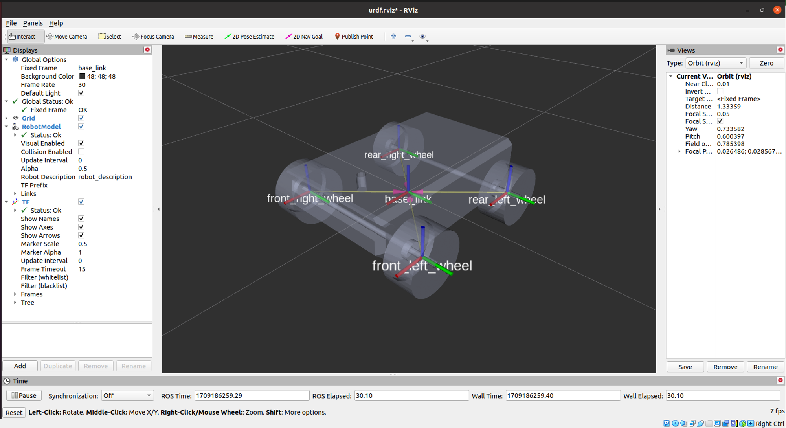
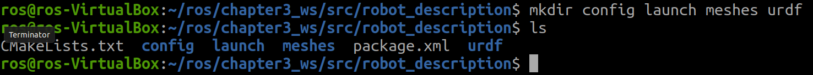
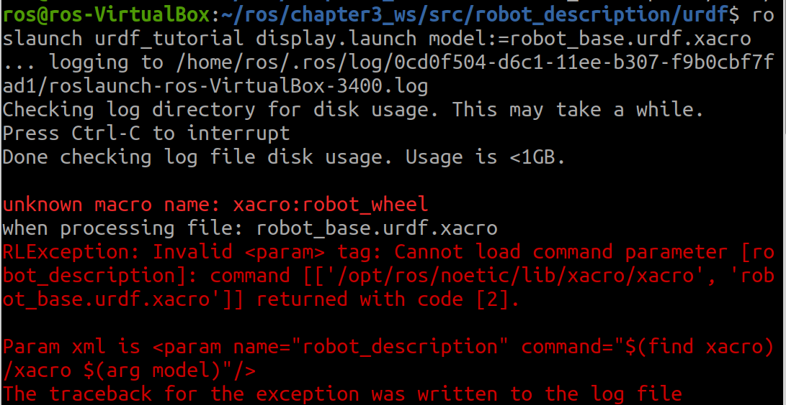
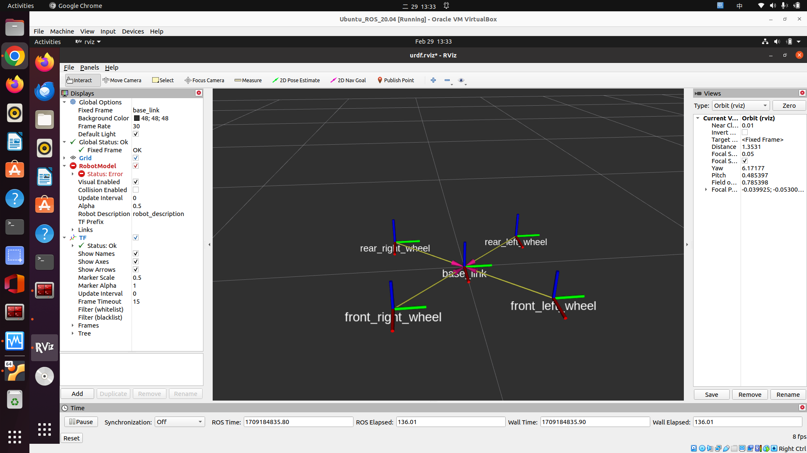
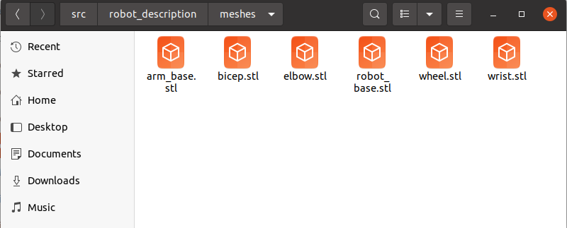
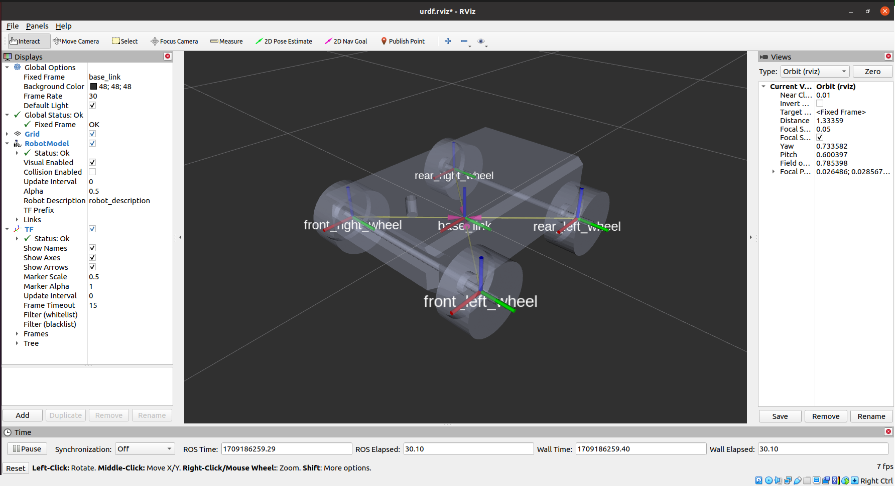

# ROS-Mechanical-Arm-01-base

＃ROS建制機械手臂（基座）

本篇將使用ROS系統建立一個機械手臂的移動基座，並且使用模擬軟體Gazebo觀察所建立的模型。會需要一點ROS的基本知識。本專案參考《機器人作業系統與專案實作》這本書。這本書有些步驟設定上有些錯誤，這一系列會修正。



1. ros_control和ros_controller套件
    1. [http://wiki.ros.org/ros_control](http://wiki.ros.org/ros_control)
    
    ```python
    sudo apt-get install ros-noetic-ros-control 
    sudo apt-get install ros-noetic-ros-controllers
    sudo apt-get install ros-noetic-Gazebo-ros-control
    ```
    
2. ros控制器
    1. diff_drive_controller
    2. [http://wiki.ros.org/diff_drive_controller](http://wiki.ros.org/diff_drive_controller)
3. 建制工作空件
    
    source 環境
    
    ```python
    initros1
    ```
    
    建制workspace
    
    ```python
    mkdir -p ./chapter3_ws/src
    cd ./chapter3_ws
    catkin_make
    ```
    
    cd ~/chapter3_ws/src
    
    ```python
    catkin_create_pkg robot_description catkin
    ```
    
    cd ~/chapter3_ws
    
    ```python
    catkin_make
    ```
    
4. cd ~/chapter3_ws/src/robot_description/ 
    1. 建立以下資料夾
    
    ```python
    mkdir config launch meshes urdf
    ```
    
    
    
5. 在~/chapter3_ws/src/robot_description/urdf下建立robot_base.urdf.xacro
    
    ```python
    <?xml version="1.0"?>
    <robot xmlns:xacro="http://ros.org/wiki/xacro" name="robot_base" >
    <xacro:include filename="$(find robot_description)/urdf/robot_base_essentials.xacro" />
    
    </robot>
    
    ```
    
6. 定義機器人底盤連結,在<robot>標籤下增加以下
    
    ```python
    <link name="base_link">
        <visual>
          <origin
            xyz="0 0 0"
            rpy="1.5707963267949 0 3.14" />
          <geometry>
            <mesh filename="package://robot_description/meshes/robot_base.stl" />
          </geometry>
          <material
            name="">
            <color
              rgba="0.79216 0.81961 0.93333 1" />
          </material>
        </visual>
      </link>
    ```
    
7. 另外建立一個檔案robot_essentials.xacro
    1. <xacro:include filename="$(find robot_description)/urdf/robot_base_essentials.xacro" />這行會將robot_base.urdf.xacro連接到這個檔案中robot_essentials.xacro
        
        
        
    
    ```python
    <?xml version="1.0"?>
    <robot xmlns:xacro="http://ros.org/wiki/xacro" name="robot_essentials" >
    <xacro:macro name="robot_wheel" params="prefix">
    <link name="${prefix}_wheel">
        <visual>
          <origin
            xyz="0 0 0"
            rpy="1.5707963267949 0 0" />
          <geometry>
            <mesh filename="package://robot_description/meshes/wheel.stl" />
          </geometry>
          <material
            name="">
            <color
              rgba="0.79216 0.81961 0.93333 1" />
          </material>
        </visual>
      </link>
    </xacro:macro>
    </robot>
    ```
    
8. 在robot_base.urdf.xacro檔案中增加以下,建立輪子的巨集
    
    ```python
    <xacro:robot_wheel prefix="front_left"/>
    <xacro:robot_wheel prefix="front_right"/>
    <xacro:robot_wheel prefix="rear_left"/>
    <xacro:robot_wheel prefix="rear_right"/>
    ```
    
9. 在robot_essentials.xacro檔案中增加以下,定義連接輪子關節
    
    ```python
    <xacro:macro name="wheel_joint" params="prefix origin">
    
    <joint name="${prefix}_wheel_joint" type="continuous">
        <axis xyz="0 1 0"/>
        <parent link ="base_link"/>
        <child link ="${prefix}_wheel"/>
        <origin rpy ="0 0 0" xyz= "${origin}"/>
      </joint>
    
    </xacro:macro>
    ```
    
10. 在robot_base.urdf.xacro檔案中增加以下,建立輪子關節來連接
    
    ```python
    <xacro:wheel_joint prefix="front_left" origin="0.220 0.250 0"/>
    <xacro:wheel_joint prefix="front_right" origin="0.220 -0.250 0"/>
    <xacro:wheel_joint prefix="rear_left" origin="-0.220 0.250 0"/>
    <xacro:wheel_joint prefix="rear_right" origin="-0.220 -0.250 0"/>
    ```
    
11. 新開的terminal使用rviz視覺化
    
    ```python
    initros1
    ```
    
    cd ~/chapter3_ws
    
    ```python
    source devel/setup.bash
    roscd robot_description/urdf/
    roslaunch urdf_tutorial display.launch model:=robot_base.urdf.xacro
    ```
    
    
    
    結果發現看不到模型,需要下載模型
    
    [https://github.com/PacktPublishing/ROS-Robotics-Projects-SecondEdition/tree/master/chapter_3_ws/src/robot_description/meshes](https://github.com/PacktPublishing/ROS-Robotics-Projects-SecondEdition/tree/master/chapter_3_ws/src/robot_description/meshes)
    
    將檔案放在/chapter3_ws/src/robot_description/meshes的資料夾下
    
    
    
    
    
12. Reference code:
    
    以上所建立兩個檔案內容如下
    
    robot_base.urdf.xacro
    
    ```python
    <?xml version="1.0"?>
    
    <robot xmlns:xacro="http://ros.org/wiki/xacro" name="robot_base" >
    <xacro:include filename="$(find robot_description)/urdf/robot_essentials.xacro" />
    <link name="base_link">
        <visual>
          <origin
            xyz="0 0 0"
            rpy="1.5707963267949 0 3.14" />
          <geometry>
            <mesh filename="package://robot_description/meshes/robot_base.stl" />
          </geometry>
          <material
            name="">
            <color
              rgba="0.79216 0.81961 0.93333 1" />
          </material>
        </visual>
      </link>
      
      
    <xacro:robot_wheel prefix="front_left"/>
    <xacro:robot_wheel prefix="front_right"/>
    <xacro:robot_wheel prefix="rear_left"/>
    <xacro:robot_wheel prefix="rear_right"/>
    
    <xacro:wheel_joint prefix="front_left" origin="0.220 0.250 0"/>
    <xacro:wheel_joint prefix="front_right" origin="0.220 -0.250 0"/>
    <xacro:wheel_joint prefix="rear_left" origin="-0.220 0.250 0"/>
    <xacro:wheel_joint prefix="rear_right" origin="-0.220 -0.250 0"/>
    
    </robot>
    
    ```
    
    robot_essentials.xacro
    
    ```python
    <?xml version="1.0"?>
    <robot xmlns:xacro="http://ros.org/wiki/xacro" name="robot_essentials" >
    <xacro:macro name="robot_wheel" params="prefix">
    <link name="${prefix}_wheel">
        <visual>
          <origin
            xyz="0 0 0"
            rpy="1.5707963267949 0 0" />
          <geometry>
            <mesh filename="package://robot_description/meshes/wheel.stl" />
            
          </geometry>
          <material
            name="">
            <color
              rgba="0.79216 0.81961 0.93333 1" />
          </material>
        </visual>
      </link>
    </xacro:macro>
    
    <xacro:macro name="wheel_joint" params="prefix origin">
    <joint name="${prefix}_wheel_joint" type="continuous">
        <axis xyz="0 1 0"/>
        <parent link ="base_link"/>
        <child link ="${prefix}_wheel"/>
        <origin rpy ="0 0 0" xyz= "${origin}"/>
      </joint>
    </xacro:macro>
    
    </robot>
    
    ```
    

**Reference:**

單位與系統座標

1. [https://ros.org/reps/rep-0000.html](https://ros.org/reps/rep-0000.html)
2. [https://www.ros.org/reps/rep-0103.html](https://www.ros.org/reps/rep-0103.html)

Gazebo內建API

[https://osrf-distributions.s3.amazonaws.com/sdformat/api/3.0/classsdf_1_1URDF2SDF.html](https://osrf-distributions.s3.amazonaws.com/sdformat/api/3.0/classsdf_1_1URDF2SDF.html)

《機器人作業系統與專案實作》提供的github

[https://github.com/PacktPublishing/ROS-Robotics-Projects-SecondEdition/tree/master/chapter_3_ws/src/robot_description](https://github.com/PacktPublishing/ROS-Robotics-Projects-SecondEdition/tree/master/chapter_3_ws/src/robot_description)

《機器人作業系統與專案實作》作者的網誌

[https://automaticaddison.com/how-to-build-a-simulated-mobile-robot-base-using-ros/](https://automaticaddison.com/how-to-build-a-simulated-mobile-robot-base-using-ros/)

[https://wiki.ros.org/xacro](https://wiki.ros.org/xacro)
